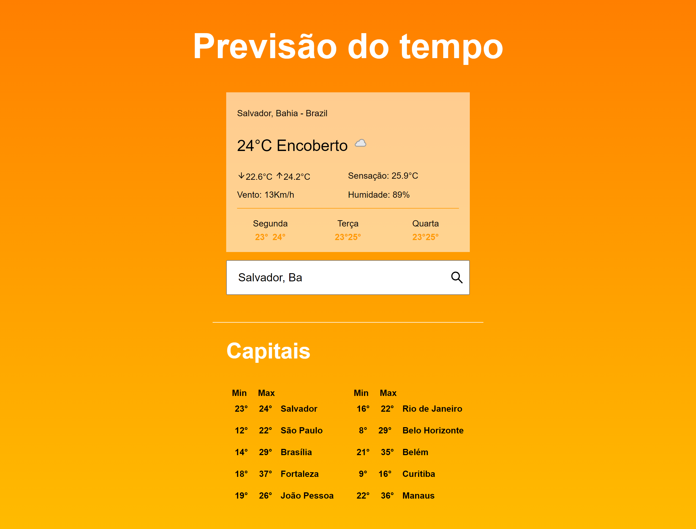
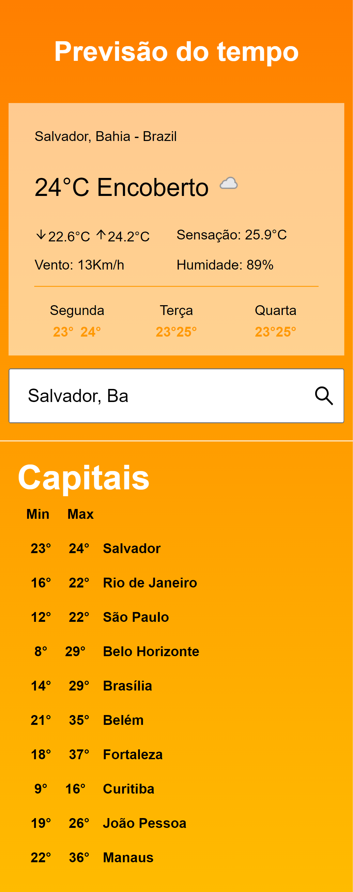

# Weather app

## This project was builded with Vite and ReactJs.

### Data is provided by [WeatherAPI](https://www.weatherapi.com/)

### Main features are:
- Search for weather conditions of the main brazilian cities;
- Search for weather conditions of the specified city;
- Responsive layout.

<br />

### Application screenshots:

<div>
    Desktop <br />
    
</div>
<br />
<div>
    Mobile <br />
    
</div>

<br />

### You can run this application by:

- Clone this repository:
```
    git clone https://github.com/Cleidson-Oliveira/weather-app.git
```

- Get in the path that was create:

```
    cd weather-app
```

- Install the dependencies:

```
    yarn

    or

    npm install
```

- Run project:

```
    yarn dev

    or

    npm run dev
```

Then, access [localhost](http://localhost:3000/).
